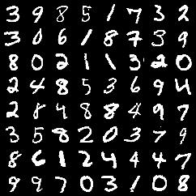

# Simple Neural Network for MNIST

[](https://www.python.org/downloads/release/python-3810/)  [](https://github.com/KD1994/session-5-MNIST-CICD/actions/workflows/python-app.yml)  


This repository contains a simple neural network implemented in PyTorch to classify MNIST digits and a CI/CD pipeline to train the model and push it to the repository.

## Requirements

- Python 3.8
- PyTorch
- torchvision
- pytest
- torchinfo

## Usage

1. Install the required packages.
2. Run `python train.py` to train the model.
3. Run `pytest -v` to execute tests.


## Network Architecture

| INPUT    | KERNEL     | OUTPUT |
|----------|------------|--------|
| 28x28x1  | 3x3x1x8    | 26     |
| 26x26x8  | 3x3x8x16   | 24     |
| Maxpool()|            | 12     |
| 24x24x16 | 3x3x16x32  | 10     |
| Maxpool()|            | 5      |
| 5x5x32   | 3x3x32x32  | 3      |
| 3x3x32   | 2x2x32x32  | 2      |
| Flatten()|            |        | 


## Model Summary

```
==========================================================================================
Layer (type:depth-idx)                   Output Shape              Param #
==========================================================================================
MnistNet                                 [1, 10]                   --
├─Sequential: 1-1                        [1, 128]                  --
│    └─Conv2d: 2-1                       [1, 8, 26, 26]            72
│    └─GELU: 2-2                         [1, 8, 26, 26]            --
│    └─BatchNorm2d: 2-3                  [1, 8, 26, 26]            16
│    └─Conv2d: 2-4                       [1, 16, 24, 24]           1,152
│    └─GELU: 2-5                         [1, 16, 24, 24]           --
│    └─BatchNorm2d: 2-6                  [1, 16, 24, 24]           32
│    └─MaxPool2d: 2-7                    [1, 16, 12, 12]           --
│    └─Conv2d: 2-8                       [1, 32, 10, 10]           4,608
│    └─GELU: 2-9                         [1, 32, 10, 10]           --
│    └─BatchNorm2d: 2-10                 [1, 32, 10, 10]           64
│    └─MaxPool2d: 2-11                   [1, 32, 5, 5]             --
│    └─Conv2d: 2-12                      [1, 32, 3, 3]             9,216
│    └─GELU: 2-13                        [1, 32, 3, 3]             --
│    └─BatchNorm2d: 2-14                 [1, 32, 3, 3]             64
│    └─Conv2d: 2-15                      [1, 32, 2, 2]             4,096
│    └─Flatten: 2-16                     [1, 128]                  --
├─Sequential: 1-2                        [1, 10]                   --
│    └─Linear: 2-17                      [1, 10]                   1,290
==========================================================================================
Total params: 20,610
Trainable params: 20,610
Non-trainable params: 0
Total mult-adds (M): 1.27
==========================================================================================
Input size (MB): 0.00
Forward/backward pass size (MB): 0.29
Params size (MB): 0.08
Estimated Total Size (MB): 0.38
==========================================================================================
```

## Data Transformations

```python
transforms.RandomRotation((-7.0, 7.0), fill=(1,)),
transforms.RandomAffine(degrees=0,  scale=(0.95, 1.05)),
transforms.ColorJitter(brightness=0.10, contrast=0.1, saturation=0.10, hue=0.1),
transforms.ToTensor(),
transforms.Normalize((0.1307,), (0.3081,))
```

Sample of transformed images (Batch):




## Training

```
Batch: 0, Loss: 2.3342, Accuracy: 6.25%
Batch: 100, Loss: 0.2291, Accuracy: 89.81%
Batch: 200, Loss: 0.0949, Accuracy: 93.07%
Batch: 300, Loss: 0.1528, Accuracy: 94.49%
Batch: 400, Loss: 0.0497, Accuracy: 95.18%
Batch: 500, Loss: 0.0733, Accuracy: 95.67%
Batch: 600, Loss: 0.0553, Accuracy: 96.02%
Batch: 700, Loss: 0.0130, Accuracy: 96.32%
Batch: 800, Loss: 0.0182, Accuracy: 96.55%
Batch: 900, Loss: 0.0834, Accuracy: 96.75%
```


## Tests

The test suite includes various tests to ensure the model's functionality and robustness:

- **Parameter Count Test**: Verifies that the model has fewer than 25,000 parameters.
- **Input Size Test**: Ensures the model produces the correct output shape for a single input.
- **Batch Input Test**: Checks the model's ability to handle batch inputs.
- **Gradient Flow Test**: Confirms that gradients are flowing through the model during backpropagation.
- **Output Range Test**: Validates that the model's output is a valid probability distribution.
- **Noisy Input Test**: Tests the model's robustness to noisy inputs.
- **Accuracy Test**: Ensures that the model reaches at least 95% accuracy in the first epoch of training on the MNIST dataset.

